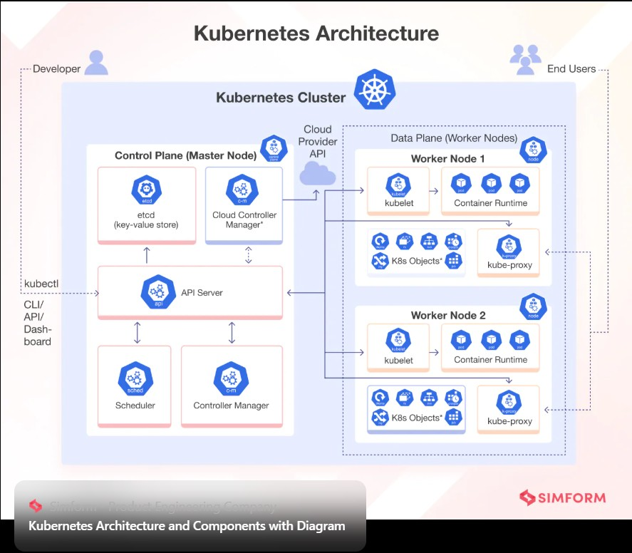

# Documentacion para Kubernetes



## Requisitos uso

### Instalar Docker
[Descargar Docker Desktop](https://www.docker.com/products/docker-desktop?utm_source=chatgpt.com)

### Instalar Curl (desde la terminal)
```powershell
Set-ExecutionPolicy Bypass -Scope Process -Force; [System.Net.ServicePointManager]::SecurityProtocol = [System.Net.SecurityProtocolType]::Tls12; iex ((New-Object System.Net.WebClient).DownloadString('https://community.chocolatey.org/install.ps1'))
choco install curl
curl --version
```

### Instalar kubectl (desde la terminal)
```powershell
curl.exe -LO https://dl.k8s.io/release/v1.30.0/bin/windows/amd64/kubectl.exe
move .\kubectl.exe "C:\Windows\System32"
kubectl version --client
```

### Instalar minikube (desde la terminal)
```powershell
choco install minikube
```

### Instalar Lens (Gestor gráfico k8s)
[Descargar Lens](https://k8slens.dev/?utm_source=chatgpt.com)

## Iniciar un clúster minikube
```bash
minikube start --driver=docker
```

## Verificar el clúster
```bash
minikube status
```
Debería devolver algo como esto:
```
minikube
  type: Control Plane
  host: Running
  kubelet: Running
  apiserver: Running
  kubeconfig: Configured
```
Ver nodos del clúster:
```bash
kubectl get nodes
```
El comando anterior debería devolver algo similar a lo siguiente:
```
NAME       STATUS   ROLES           AGE   VERSION
minikube   Ready    control-plane   10m   v1.32.0
```

## Detener el clúster
```bash
minikube stop
```

## Eliminar el clúster
```bash
minikube delete
```

---

## ¿Qué son los Pods?
Un Pod es la unidad desplegable más pequeña de Kubernetes. Ejecuta uno o más contenedores estrechamente acoplados con el mismo almacenamiento, red y espacio de nombres.

Un ejemplo de YAML para crear un Pod:
```yaml
apiVersion: v1
kind: Pod
metadata:
  name: my-pod
spec:
  containers:
  - name: nginx-container
    image: nginx:1.21
    ports:
    - containerPort: 80
```
Instálalo usando:
```bash
kubectl apply -f pod.yaml
```

## ¿Qué son los Despliegues?
Un Despliegue es un objeto Kubernetes de nivel superior que se utiliza para gestionar el ciclo de vida de los Pods. Garantiza que se ejecuta el número deseado de réplicas Pod y gestiona las actualizaciones y retrocesos.

Ejemplo de YAML para un Despliegue con 3 réplicas:
```yaml
apiVersion: apps/v1
kind: Deployment
metadata:
  name: nginx-deployment
spec:
  replicas: 3
  selector:
    matchLabels:
      app: nginx
  template:
    metadata:
      labels:
        app: nginx
    spec:
      containers:
      - name: nginx
        image: nginx:1.21
        ports:
        - containerPort: 80
```
Instálalo usando:
```bash
kubectl apply -f deployment.yaml
```

## ¿Qué son los Servicios?
Un Servicio es una abstracción que proporciona un acceso de red estable a los Pods, aunque cambien sus direcciones IP.

Ejemplo de YAML para exponer nuestro servidor web nginx al exterior del clúster:
```yaml
apiVersion: v1
kind: Service
metadata:
  name: nginx-service
spec:
  selector:
    app: nginx
  ports:
  - protocol: TCP
    port: 80
    targetPort: 80
  type: NodePort
```
Instálalo usando:
```bash
kubectl apply -f service.yaml
```

Puedes ver los endpoints del servicio con:
```bash
kubectl describe service nginx-service
```

## ¿Qué son los espacios de nombres?
Los espacios de nombres en Kubernetes te permiten organizar y aislar recursos dentro de un clúster.

Ejemplo de YAML para crear un Namespace:
```yaml
apiVersion: v1
kind: Namespace
metadata:
  name: my-namespace
```
Guárdalo como `namespace.yaml` y aplícalo usando:
```bash
kubectl apply -f namespace.yaml
```

Listar todos los namespaces con:
```bash
kubectl get namespaces
```

Un despliegue en un namespace específico se vería así:
```yaml
apiVersion: apps/v1
kind: Deployment
metadata:
  name: nginx-deployment
  namespace: my-namespace
spec:
  replicas: 3
  selector:
    matchLabels:
      app: nginx
  template:
    metadata:
      labels:
        app: nginx
    spec:
      containers:
      - name: nginx
        image: nginx:1.21
        ports:
        - containerPort: 80
```
Y para consultar recursos en un namespace:
```bash
kubectl get deployment -n my-namespace
```

---

# Gestionar una aplicación con Kubernetes

## Crear un despliegue de aplicación web sencillo
Crear un archivo llamado `nginx-deployment.yaml`:
```yaml
apiVersion: apps/v1
kind: Deployment
metadata:
  name: nginx-deployment
spec:
  replicas: 1
  selector:
    matchLabels:
      app: nginx
  template:
    metadata:
      labels:
        app: nginx
    spec:
      containers:
      - name: nginx
        image: nginx:latest
        ports:
        - containerPort: 80
```
Aplicar la implementación:
```bash
kubectl apply -f nginx-deployment.yaml
kubectl get pods
```

## Exponer la aplicación con un servicio
Crear un archivo llamado `nginx-service.yaml`:
```yaml
apiVersion: v1
kind: Service
metadata:
  name: nginx-service
spec:
  selector:
    app: nginx
  ports:
  - protocol: TCP
    port: 80
    targetPort: 80
  type: NodePort
```
Aplicar el servicio:
```bash
kubectl apply -f nginx-service.yaml
```
Obtener la URL del servicio:
```bash
minikube service nginx-service --url
```
Abrir la URL en tu navegador, y se deberia ver la página de bienvenida de nginx.

## Escalar la aplicación
Escalar el despliegue a 3 réplicas:
```bash
kubectl scale deployment nginx-deployment --replicas=3
kubectl get pods
kubectl get endpoints nginx-service
```

## Actualizaciones continuas
Actualizar la versión de nginx:
```bash
kubectl set image deployment/nginx-deployment nginx=nginx:1.23
kubectl rollout status deployment/nginx-deployment
```

## Gestionar recursos de Kubernetes
Listar recursos:
```bash
kubectl get pods
kubectl get services
kubectl get deployments
```
Describir recursos:
```bash
kubectl describe deployment nginx-deployment
kubectl logs <pod-name>
```
Eliminar recursos:
```bash
kubectl delete pod <pod-name>
kubectl delete deployment nginx-deployment
kubectl delete all --all
```

---

